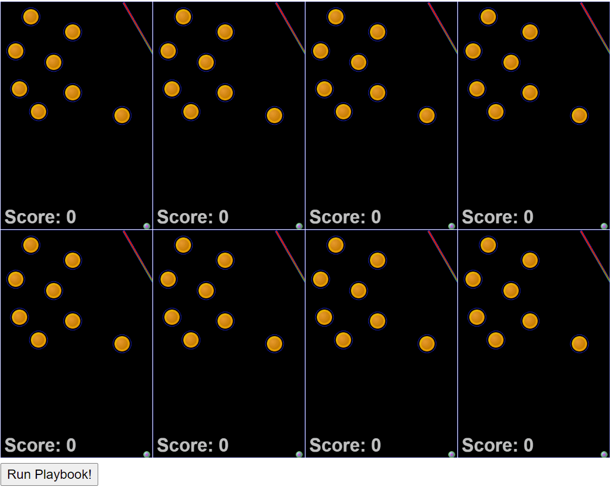

# Pincrediball Prototype 005

This is the fifth prototype, published purely for fun.
There will probably be no further documentation or info or updates on this repository.

The prototype was meant to see how to make the engine (more) deterministic.

Check out [the pincrediball.com devlog](https://www.pincrediball.com/devlog) for more in-depth updates about development.

## Screenshot

The latest state of this prototype was like this, showing the same game multiple times in parallel, luckily always showing the same outcome:

